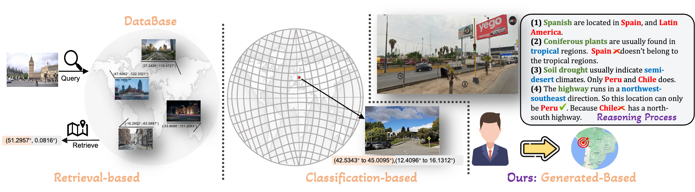

# Geocomp: 基于真实人类游戏数据的地理定位：大规模数据集与类人推理框架

[](https://arxiv.org/abs/2502.13759)


## 📝 简介

Geocomp 是一个专注于**图像地理定位 (Geolocation)** 的研究项目和代码库。地理定位旨在精确识别图像的拍摄地点，这在导航、自动驾驶、内容审核和文化遗产保护等领域至关重要，但其内在的复杂性对现有方法提出了巨大挑战。当前主流方法往往产生粗糙、不精确且缺乏可解释性的定位结果。这部分归因于现有基准数据集规模有限、多为自动构建、包含噪声，且任务难度分布不均（图像线索要么过于明显，要么严重不足），难以有效评估和推动模型高级推理能力的发展。

为应对这些挑战，本项目提出了一个综合性的地理定位研究框架，包含三大核心组件：

1.  **GeoComp 数据集**: 一个源自真实人类玩家参与的大规模、高质量地理定位竞赛数据集。
2.  **GeoCoT 推理方法**: 一种模仿人类思维链（Chain-of-Thought）的地理空间推理框架，旨在提升大型视觉语言模型的地理定位能力。
3.  **GeoEval 评估体系**: 一套专门设计的、用于全面评估地理定位模型性能和推理过程的指标与工具。

本项目致力于通过这套框架，解决当前地理定位研究中的关键瓶颈问题，推动该领域取得实质性进展。

<p align="center">
  
</p>

## ✨ 主要特性

* **大规模真实世界数据集 (GeoComp)**:
    * 源自 74 万用户在两年多时间内于在线地理定位游戏平台 (tuxun.fun) 产生的真实交互数据。
    * 包含 2500 万条元数据记录和 **300 多万个**带有地理标签的街景地点，覆盖全球广泛区域。
    * 每个地点都经过数千乃至数万次人类玩家的定位尝试，蕴含了丰富的任务难度信息和宝贵的真实世界人类表现基准。
* **类人推理框架 (GeoCoT)**:
    * 提出新颖的多步骤地理链式思维（GeoCoT）框架，显著增强大型视觉语言模型（LVM）在复杂地理定位任务中的推理能力。
    * 模仿人类从宏观环境（气候、地貌、植被）到微观细节（路牌语言、建筑风格、车辆特征）的推理过程，有效整合图像中的上下文与空间线索。
    * 实验证明，GeoCoT 可显著提升地理定位准确率（最高达 **25%**），同时增强模型决策过程的可解释性。
* **全面的评估体系 (GeoEval)**:
    * 包含与人类专家标注的“黄金”推理过程进行比较的指标，以及对模型自身推理逻辑链的内在一致性评估。
    * 引入细致的幻觉评估维度（物体幻觉 OH, 事实幻觉 FH, 归因幻觉 AH），全方位确保模型推理结果的可靠性与真实性。
* **基准模型与完整代码**:
    * 提供多种地理定位基准模型的实现 (`baseline`)，方便研究者进行公平比较。
    * 开源包含数据处理 (`Dataset`)、核心方法 (`Geocot`) 和评估 (`Geoeval`) 的完整代码，支持社区复现与扩展。

## 📄 论文

关于本项目的详细信息、方法论和详尽的实验结果，请参阅我们的 arXiv 论文：

**Geolocation with Real Human Gameplay Data: A Large-Scale Dataset and Human-Like Reasoning Framework**
[https://arxiv.org/abs/2502.13759](https://arxiv.org/abs/2502.13759)

### 💡 重新思考地理定位任务

<p align="center">
  
</p>

传统的地理定位方法主要依赖于分类（将地球划分为预定义网格）或检索（在大规模数据库中匹配视觉相似图像）。这些方法虽然取得了一定进展，但在定位精度、对新区域的泛化能力以及结果的可解释性方面常表现出局限性。受人类专家进行地理定位时“由粗到精、逐步缩小范围”这一自然过程的启发，我们提出了一种新的地理定位范式：**利用大型模型生成连贯的、分步骤的自然语言推理链，最终推导出图像的精确地理位置**。GeoCoT 框架正是为实现这一生成式推理范式而设计，旨在克服传统方法的瓶颈，提升定位的准确性、鲁棒性和透明度。

<p align="center">
  
</p>

## 📁 代码库结构

```text
Geocomp/
├── docs/                  # 文档和项目相关的静态资源 (例如 GitHub Pages 站点文件)
│   └── assets/            # 存放 README、文档中使用的图片、PDF 等资源
├── Hallucination/         # 模型推理结果的人工幻觉评估数据
│   ├── GeoCoT.csv         # GeoCoT 方法的幻觉评估结果
│   ├── GeoReasoners.csv   # GeoReasoners 基准的幻觉评估结果
│   └── GPT4o.csv          # GPT-4o 基准的幻觉评估结果
├── src/                   # 项目核心源代码
│   ├── baseline/          # 各种地理定位基准模型的实现代码
│   ├── Dataset/           # 数据集处理、加载及与街景 API 交互的代码
│   ├── Geocot/            # GeoCoT 核心推理框架的实现与测试代码
│   └── Geoeval/           # GeoEval 评估体系的实现代码 (包含各种评估指标和工具)
├── requirements.txt       # 项目 Python 依赖库列表
├── README_zh.md           # 本 README 文件 (中文版)
├── README.md              # README 文件 (英文版)
└── ...                    # 其他配置文件、脚本等
```
关键目录说明:src/baseline: 存放了用于比较实验的各种基准模型的实现代码和运行脚本。

 **`src/baseline`**: 存放了用于比较实验的各种基准模型的实现代码和运行脚本。
 
**`src/Dataset`**: 包含了数据下载、预处理、数据加载器以及与 Google Street View 等 API 交互以获取图像数据的相关代码 (例如 `street_view_api.py`)。

**`src/Geocot`**: 包含实现 GeoCoT 推理框架的核心逻辑代码，以及用于运行和测试该方法的脚本。

* **`src/Geoeval`**: 提供了 GeoEval 评估体系的完整实现，包括计算地理距离误差、各种分类/回归指标、推理链与 Ground Truth 的相似度评估、以及幻觉检测等功能的脚本。

* **`Hallucination`**: 包含了对不同模型（本项目方法 GeoCoT 及基准模型 GeoReasoners, GPT-4o）推理输出进行详细人工幻觉评估后得到的原始数据（CSV 格式）。
  
* **`docs`**: 存放用于本文档和项目主页的图片、图表（如 `case.png`）以及可能的补充 PDF 材料。

## 📊 幻觉评估
为了深入评估模型生成推理内容的可信度，我们对模型输出进行了细致的人工幻觉检查。评估过程严格遵循预定义标准，主要关注以下三种类型的幻觉错误：

物体幻觉 (Object Hallucination, OH): 模型描述了图像中实际不存在的物体、特征或元素。

事实幻觉 (Fact Hallucination, FH): 模型陈述了与公认的地理、文化或常识性事实不符的信息（例如，错误的地标名称、不符的地理位置关系、错误的气候描述等）。

归因幻觉 (Attribution Hallucination, AH): 模型错误地解释了图像中实际存在的元素，或将其属性、来源、含义归因于错误的国家、地区、文化或对象。

每个评估样本均由具备相关地理背景知识的人工标注员进行独立判断。标注员会仔细比对原始街景图像和模型的推理文本，逐项检查是否存在上述三类幻觉问题。详细的评估结果统计存储在 Hallucination/ 目录下的 CSV 文件中。

## ⚙️ 安装

```bash
# 克隆仓库
git clone https://github.com/yydsok/Geocomp.git
cd Geocomp
# 创建虚拟环境 (推荐)
python -m venv venv
source venv/bin/activate  # Linux/macOS
# venv\Scripts\activate  # Windows
# 安装依赖
pip install -r requirements.txt # 请确保 requirements.txt 文件存在且包含所有依赖
# 其他必要的设置步骤... (例如：API密钥配置)
```
🚀 使用说明
```
# 如何运行 GeoCoT 进行推理和预测
python src/Geocot/run_geocot.py 
# 如何使用 GeoEval 进行评估
python src/Geoeval/evaluate_model.py 
# 如何运行基准模型
python src/baseline/[某个基准模型]/run.py --config [配置文件路径]
```

🤝 贡献指南我们欢迎各种形式的贡献！如果你想为项目做出贡献，请 [说明贡献方式，例如：查阅 CONTRIBUTING.md 文件、提交 Pull Request 或 Issue]。

📄 许可证本项目采用 [在此处填写许可证名称，例如：MIT] 许可证。详情请见 LICENSE 文件（如果创建了该文件）。

📧 联系方式与引用如果您对本项目有任何疑问，或者在您的研究中使用了本项目，请联系 [你的邮箱地址] 或通过 GitHub Issues 提出。如果本项目的数据集 (GeoComp)、方法 (GeoCoT) 或评估工具 (GeoEval) 对您的研究有所帮助，请考虑引用我们的论文：@misc{song2025geocomp,

      title={Geolocation with Real Human Gameplay Data: A Large-Scale Dataset and Human-Like Reasoning Framework},

      author={Zirui Song and Jingpu Yang and Yuan Huang and Jonathan Tonglet and Zeyu Zhang and Tao Cheng and Meng Fang and Iryna Gurevych and Xiuying Chen},

      year={2025},

      eprint={2502.13759},

      archivePrefix={arXiv},

      primaryClass={cs.CV}

}


